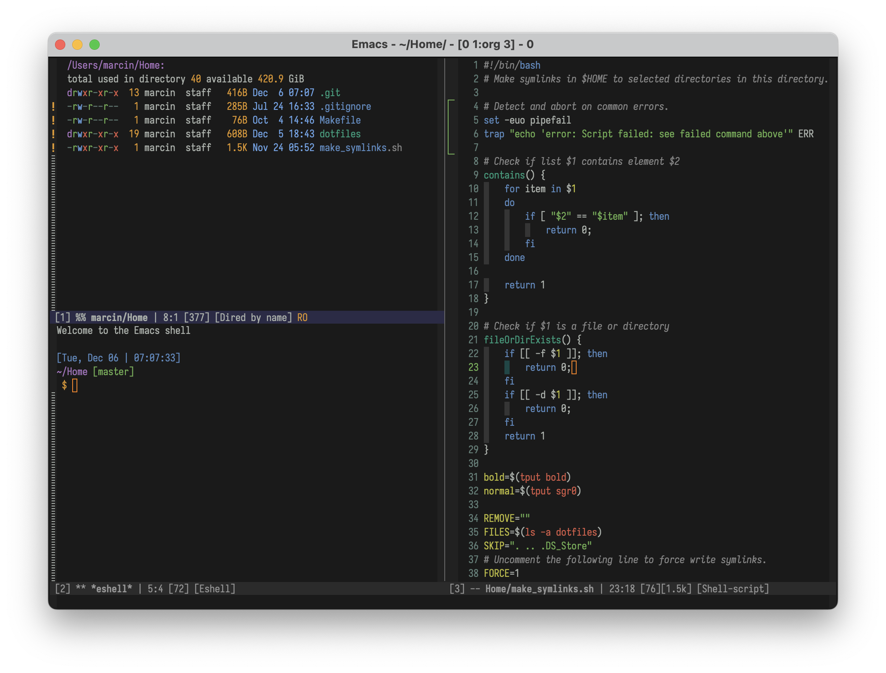

# Nimbus

[](https://melpa.org/#/nimbus-theme)
[](https://github.com/m-cat/nimbus-theme/issues)
[](https://opensource.org/licenses/GPL-3.0)

Nimbus dark theme for Emacs.



> nimbus: (Latin) rainstorm, rain cloud

## About

I wanted to make a theme that would bring me joy every day. I wanted something
beautiful, slightly retro, yet readable and easy on the eyes. I regularly add
and modify faces and am always looking to support more third-party packages.

[User testimonial!](https://grtcdr.tn/posts/2022-12-05.html)

Nimbus was originally a fork of [Ample](https://github.com/jordonbiondo/ample-theme).

## Installing

Make sure you have set up [MELPA](http://melpa.org/#/getting-started) and run:

```
M-x package-install RET nimbus-theme RET
```

Use `M-x customize-themes` to activate it, or put the following in your Emacs configuration file:

```elisp
(load-theme 'nimbus t)
```

Or, if you have [use-package](https://github.com/jwiegley/use-package):

```elisp
(use-package nimbus-theme)
```

### Troubleshooting

If you encounter any issues with Nimbus (such as text faces being hard to read or not appearing as expected), please try the following:

1. Restart Emacs and make sure Nimbus is the first theme you enable. Switching custom themes during an Emacs session may cause artifacts from the previous theme to remain.
1. Leave a bug report on [GitHub](https://github.com/m-cat/nimbus-theme/issues). Please try to include screenshots as well as full instructions for reproducing your problem, including setup of the relevant mode.

## Contributing

All contributions are welcome. I want to support as many third-party Emacs packages as possible. Please write issues and raise pull requests!

### Contributors

- Marcin Swieczkowski [[GitHub](https://github.com/m-cat)] -- The head honcho
- Jordon Biondo [[GitHub](https://github.com/jordonbiondo)] -- Creator of [Ample Theme](https://github.com/jordonbiondo/ample-theme)
- Davor Rotim [[GitHub](https://github.com/drot)]
- Pierre Le Gall [[GitHub](https://github.com/pierrelegall)]
- Bruno [[GitHub](https://github.com/arzoriac)]
- Jorge Araya Navarro [[GitHub](https://github.com/shackra)]
- Dario Gjorgjevski [[GitHub](https://github.com/d125q)]
- Aziz Ben Ali [[GitHub](https://github.com/grtcdr)]

## Related Projects

- [Nimbus for VSCode](https://github.com/m-cat/nimbus-theme-vscode)
- [Nimbus-Pygments](https://github.com/m-cat/nimbus-pygments) (for static site generators)
